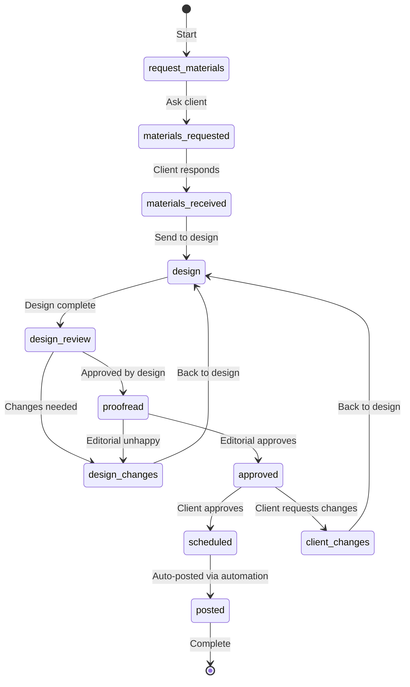

# Content Calendar Workflow

## Overview

Content calendars plan, design, and schedule social media content for clients. The workflow moves content through production, design, editorial, client approval, and scheduling before automated posting.

## Status Chain

```
request_materials → materials_requested → materials_received
  → design → design_review → proofread → approved → scheduled → posted
```

## Branch Statuses (Loops)

- **design_changes** → loops back to `design` (editorial sends back for design fixes)
- **client_changes** → loops back to `design` (client requests modifications)

## Workflow Diagram



## Department Routing

| Status | Department | Description |
|--------|-----------|-------------|
| `request_materials` | Production | Ask client for the month's materials (focus points, images, assets) |
| `materials_requested` | Production | Waiting for client response |
| `materials_received` | Production | Client has provided materials; ready to hand off to design |
| `design` | Design | Create designs, captions, and post dates |
| `design_review` | Design | Internal design review |
| `design_changes` | Design | Fix issues flagged by editorial or client |
| `proofread` | Editorial | Proofread all content; can send back to design if unhappy |
| `approved` | Social Media | Client has approved; ready for scheduling |
| `client_changes` | Production | Client requested modifications; route back to design |
| `scheduled` | Social Media | Content scheduled for automated posting |
| `posted` | Social Media | Content posted via social media automation |

## Detailed Flow

1. **Request Materials** (Production): Production team contacts the client to ask what topics, themes, or products they want to highlight, and to collect any supporting images or assets for the month.

2. **Design** (Design): Design team creates the social media designs with captions and proposed post dates based on the client's materials.

3. **Editorial Review** (Editorial): Editorial team proofreads all captions and content. If editorial is unhappy with anything, they send it back to design via `design_changes`.

4. **Client Approval** (Social Media): The completed content calendar is sent to the client. If the client requests changes, it goes back to design via `client_changes` → design → editorial → back to client.

5. **Scheduling & Posting** (Social Media): Once approved, content is scheduled in the social media management tool. A social media posting automation handles the actual posting at the scheduled times.

## Deliverable Type

- **Type key**: `sm-content-calendar`
- **Initial status**: `request_materials`
- **Created per**: Each active month in the booking form campaign range
